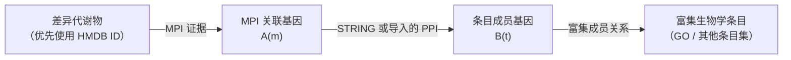

# MetaNetAssoc（中文说明）

`MetaNetAssoc` 发布 **MetaNetAssoc 0.4.0**：一个用于整合差异代谢物、差异基因（DEG）、代谢物–蛋白相互作用（MPI）、蛋白质–蛋白质相互作用（PPI）网络和基因富集结果的 R 包。

它回答的核心问题不是“哪个代谢物一定会结合哪个蛋白”，而是：

> 哪些差异代谢物与差异基因集富集出的生物学过程之间存在网络支持的潜在关联？

结果会保留可审计的“代谢物–基因–基因–生物学条目”路径，并提供原始、加权、归一化和覆盖度评分。

## 安装

### 安装已打包版本

下载 [`dist/MetaNetAssoc_0.4.0.tar.gz`](dist/MetaNetAssoc_0.4.0.tar.gz)，在 R/RStudio 中运行：

```r
install.packages(
  "MetaNetAssoc_0.4.0.tar.gz",
  repos = NULL,
  type = "source"
)

library(MetaNetAssoc)
packageVersion("MetaNetAssoc")
# [1] "0.4.0"
```

### 从 GitHub 安装

```r
install.packages("remotes")
remotes::install_github(
  "Pengzhi-Gao/MetaNetAssoc"
)
```

可选功能需要额外依赖：

```r
install.packages(c("ggplot2", "igraph"))

install.packages("BiocManager")
BiocManager::install(c(
  "clusterProfiler",
  "org.Hs.eg.db",
  "org.Mm.eg.db"
))
```

## 算法原理

MetaNetAssoc 使用四层网络：



对每个候选代谢物，程序会：

1. 获取 MPI 关联基因集 `A(m)`；
2. 执行或导入 DEG 富集分析，得到条目成员基因集 `B(t)`；
3. 查找连接 `A(m)` 和 `B(t)` 的 PPI 边；
4. 保留支持路径 `m → g₁ → g₂ → t`；
5. 计算每个代谢物–条目组合的关联评分。

当 `include_overlap = TRUE` 时，MPI 基因如果本身属于某个富集条目，也会作为直接的 `gene_overlap` 路径保留。

### 评分指标

- **`edge_count`**：保留的支持路径数量。
- **`weighted_sum`**：MPI 证据权重 × PPI 置信度，以及可选 hub 调整因子的总和。
- **`possible_pairs = |A(m)| × |B(t)|`**：理论上可能的配对数。
- **`normalized_score = weighted_sum / possible_pairs`**：按两侧基因集大小归一化。
- **`relation_coverage`**：建立连接的 MPI 基因比例。
- **`term_coverage`**：被代谢物关联基因触达的条目成员基因比例。

归一化评分和覆盖度有助于避免大型条目或高度多连接的代谢物仅因候选配对较多而占据优势。

## 所需输入

| 输入 | 必需字段 | 作用 |
|---|---|---|
| DEG | 基因符号向量，或包含 `gene` 列的数据框 | PPI 和富集分析的起始基因 |
| 差异代谢物 | HMDB ID 向量，或包含 `hmdb_id` 列的数据框 | 稳定的代谢物标识符 |
| MPI 证据表 | `hmdb_id`/`metabolite_id`、`relation_gene`，可选来源和权重 | 可追溯的代谢物–基因证据 |
| PPI 表 | STRING 网络或导入的端点–评分表 | 带置信度的基因–基因网络 |
| 富集表 | `clusterProfiler` 结果或条目–基因长表 | 定义条目及其成员基因 |

真实研究建议使用可审计的 HMDB–基因证据表：

```r
my_mpi_database <- data.frame(
  hmdb_id = c("HMDB0000122", "HMDB0000062"),
  metabolite_name = c("Choline", "L-Carnitine"),
  relation_gene = c("CHKA", "CPT1A"),
  mpi_source = c("curated_source", "curated_source"),
  mpi_weight = c(0.95, 0.90)
)
```

包内的小型 HMDB 数据仅用于教程和测试，不应作为真实生物学证据。

## 标准分析流程

```r
library(MetaNetAssoc)

deg <- c("CHKA", "SLC44A1", "CPT1A")
hmdb <- c("HMDB0000122", "HMDB0000062")

ppi <- build_ppi_network(
  deg,
  species = "human",
  score_threshold = 400
)

mpi <- build_mpi_network(
  deg,
  hmdb,
  species = "human",
  mpi_database = my_mpi_database
)

enr <- run_deg_enrichment(
  deg,
  species = "human",
  ontology = "BP",
  export_file = "GO_enrichment.csv"
)

fit <- run_metanet(
  metabolites = hmdb,
  mpi = mpi,
  ppi = ppi,
  enrichment = enr$enrichment,
  focus_genes = deg
)

head(result_scores(fit))
result_qc(fit)
plot_term_ranking(fit)
plot_score_heatmap(fit)
plot_association_network(fit)
```

`build_ppi_network()` 可以自动处理 STRING API 的 0–1 评分和下载表中的 0–1000 评分。若在线查询因防火墙或 TLS 设置失败，可以下载 STRING 边表后通过 `string_data` 传入，实现完全离线的 PPI 分析。

## MPI 匹配诊断

如果 MPI 结果为空，通常是输入数据没有重叠。可以使用：

```r
mpi <- build_mpi_network(
  deg,
  hmdb,
  mpi_database = my_mpi_database
)
attr(mpi, "matching_diagnostics")
```

诊断信息包括输入 DEG 数量、输入 HMDB ID 数量、MPI 数据库中匹配的 DEG 和 HMDB ID 数量，以及最终形成的联合 MPI 边数量。一条有效边要求同一个代谢物至少连接到一个输入 DEG。

## 人类和小鼠 MPI 参考网络

```r
human_mpi <- load_mpi_reference("human")
mouse_mpi <- load_mpi_reference("mouse")
```

| 参考网络 | 规模 | 来源与限制 |
|---|---:|---|
| 人类 | 27,945 条 MPI 边 | 整合 KEGG、Reactome、Human-GEM 和 BRENDA 证据 |
| 小鼠 | 30,963 条 MPI 边 | 基于 Ensembl Compara 同源关系对人类证据进行投射 |

两份参考网络使用 `metabolite_kegg_id`（KEGG Compound ID），不是 HMDB ID。若要用于 HMDB 工作流，需要加入有文档记录的 HMDB–KEGG 对照表并提供 `hmdb_id` 字段。

小鼠参考网络不是独立整理的小鼠生化证据，而是跨物种同源关系投射结果。

## 输出和可视化

`run_metanet()` 返回 `MetaNetResult` 对象：

| 函数 | 返回内容 |
|---|---|
| `result_scores(fit)` | 代谢物–条目评分和覆盖度指标 |
| `result_edges(fit)` | 每一条代谢物–基因–基因–条目路径 |
| `result_qc(fit)` | 输入、匹配和网络覆盖度质量控制摘要 |
| `result_unmatched(fit)` | 未匹配的代谢物或基因 |
| `result_term_reduction(fit)` | 冗余条目归并映射 |

常用绘图函数包括 `plot_term_ranking()`、`plot_score_heatmap()` 和 `plot_association_network()`。绘图需要 `ggplot2`，网络图还需要 `igraph`。

## 教程和源码结构

- [`MetaNetAssoc/`](MetaNetAssoc/)：R 包源码、帮助页、测试、示例数据和 MPI 参考数据。
- [`MetaNetAssoc/vignettes/deg-hmdb-workflow.Rmd`](MetaNetAssoc/vignettes/deg-hmdb-workflow.Rmd)：DEG + HMDB 工作流教程。
- [`dist/MetaNetAssoc_0.4.0.tar.gz`](dist/MetaNetAssoc_0.4.0.tar.gz)：可安装的 R 源码包。

安装后可运行：

```r
vignette("deg-hmdb-workflow", package = "MetaNetAssoc")
```

## 解释边界和限制

MetaNetAssoc 识别的是**网络支持的潜在关联**，不能证明直接代谢物结合、调控方向、因果关系或临床效应。解释结果时，还应结合代谢物鉴定可信度、DEG/代谢物变化方向和幅度、物种、反应背景以及独立实验验证。
